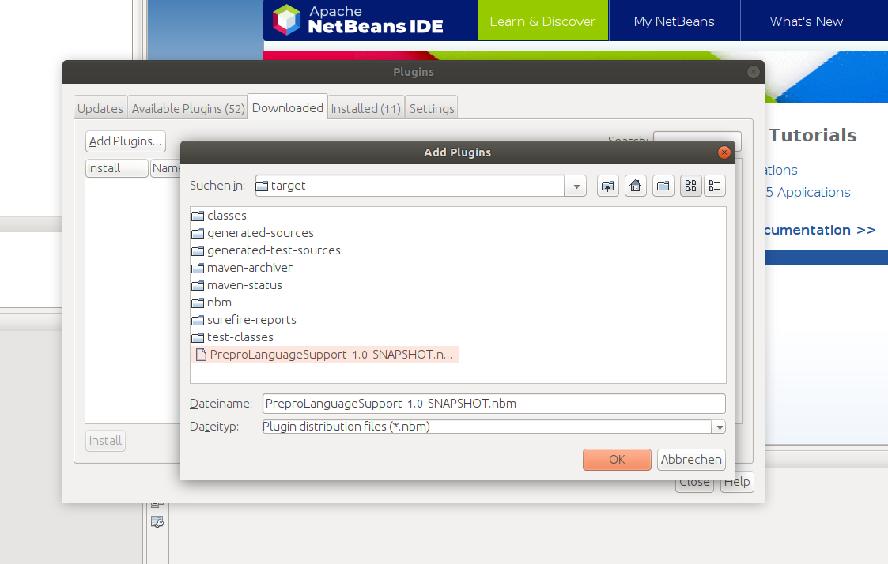
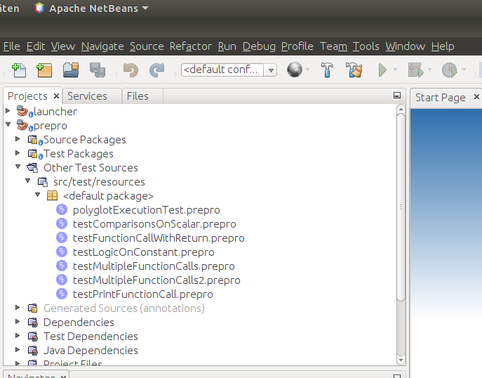

# PreproLanguageSupport

## Syntax Higlighting/ File Type Recognition
Project to create a NetBeans Plugin for file type recognition and syntax highlighting of PrePro.

To create the .nbm file run

```shell
$ mvn package 
```
in the main directory. 

The .nbm file can than be found in the target folder. To install the Plugin open the NetBeans IDE. Go to Tools > Plugins.
Select the Tab Downloaded and add the .nbm file from the target folder by clicking the Button AddPlugins...
Install the Plugin by following the installation dialogue.



You can check that the Plugin is working by opening a PrePro-File. If it is preceded by the PrePro-Icon everything is fine. 
Eventually you might need to restart your IDE.



## Debugging
To enable debugging of PrePro-Files in NetBeans you have to install the prepro-component (output of [PrePro-Implementation](https://github.com/MobMonRob/DL4JDSLStudien2/tree/master/preprolanguage/component)) into the GraalVM. Look for the prepro-component.jar file in the target folder of the component directory. 

Install this component with the gu (GraalUpdater) by running the folling command
```shell
$ gu install -L </path/to/>prepro-component.jar
```

Check if the component is correctly installed by running 
```shell
$ gu list
```
If PrePro is listed everything worked!

You then can start debugging by setting a breakpoint in the Java Program that executes a PrePro-Script. When you now run the program in Debug Mode you can step through your PrePro-Script.
